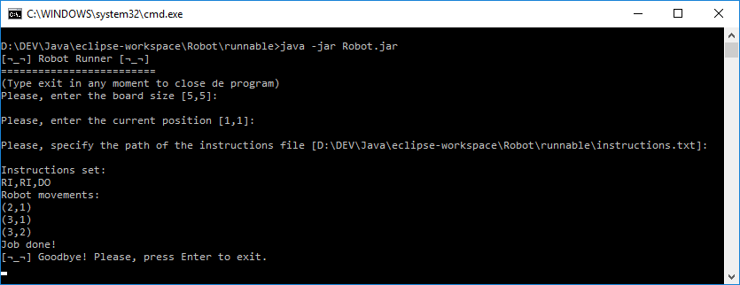

# Robot Runner
This program moves a robot in a two dimensions board following the instructions provided by the user. It works in the command line interface.
## Getting Started

These instructions will get you a copy of the project up and running on your local machine for development and testing purposes. See installing section for notes on how to deploy the project on a live system.

### Prerequisites

Install Java SE Runtime Environment (http://www.oracle.com/technetwork/es/java/javase/downloads/jre8-downloads-2133155.html)

### Installing

Copy the "runnable" directory into your computer, that's all! 

##### Test run for Windows:
  - Run the "Robot.bat" file located into the "runnable" directory

##### Test run for Linux:
  - In a terminal run the following command in order to give execution permissions:
```
chmod +x Robot.sh
```
  - Run the "Robot.sh" file

##### Test run using Java:
- In a machine with the JRE installed run:
```
java -jar Robot.jar
```
In all the cases you should see the following appear in the CLI:
```
[¬_¬] Robot Runner [¬_¬] 
=========================
```
## User's manual

#### Basics
The robot moves through a rectangle board of x,y dimentions where x and y are integers (something like a chess board with variable height and width). The user can input three values, the board size, the current position of the robot and the path of an instructions file which contains the movement instructions. The user can write "exit" in any moment to end the program.


#### User inputs
##### Board size and robot's current position
The input format that the user must employ for the board size and the robot's current position are two integers separated by a comma (x,y) without spaces or other characters. If the user doesn't use this format, the program will ask the user to try again.
##### Instructions file
The movement instructions must be provided in a .txt file that must contain any number of the following four instructions, separated by comma:

  - LE: Move to the left
  - RI: Move to the right
  - UP: Move up
  - DO: Move down
 
This is an example of the contain of a valid instructions file:
```
DO,RI,LI,UP,DO,DO,DO,RI,LE
```
If the file doesn't exist, the user will be asked to try again, but, if the program have troubles reading the provided instructions file or if the instructions set are in a wrong format, the program will exit, because they are not problems that the user can correct in the command line interface.
##### Default values
The user can press Enter without input a value, to pick automatically the default values displayed between square brackets. The default values are:
  - Board size: 5,5
  - Current position: 1,1
  - Instructions file path (located in the same folder of the program): instructions.txt


## Running the tests

### Manual testing

The runnable folder includes four "instructions.txt" files you can use for testing purposes, choosing them when running the program:
  - instructions.txt
  - instrucions_test_1.txt
  - instrucions_test_2.txt
  - instrucions_test_3.txt

### JUnit testing with Eclipse
You can download Eclipse IDE, import the project and run the tests. 
### JUnit testing via CLI
If you want to run the tests from the console without using any IDE, the project includes the "tests" folder, which have a Junit 5 dependency "lib" folder and the "robot" package folder. The procedure to run the tests from the console is described below:
  - Open a CLI and go to the "tests" folder
  - The tests included needs the "instructions.txt" files that are in the "tests" folder, please don't delete it
  - The project includes the compiled files "robot.class" and "robottest.class", but if you want you could compiles it again by using the following command:
```
javac -cp lib/*;robot robot/RobotTest.java
javac -cp lib/*;robot robot/Robot.java
```
  - Then you need to run the JUnit Console Launcher included in the "lib" folder:
```
java -cp lib/*; org.junit.platform.console.ConsoleLauncher -p robot
```
  - The results must be something like this:
```
--Movement test 1--
Instructions set:
RI,RI,DO
Robot movements:
(2,1)
(3,1)
(3,2)
...All the other tests...
Test run finished after 109 ms
[         3 containers found      ]
[         0 containers skipped    ]
[         3 containers started    ]
[         0 containers aborted    ]
[         3 containers successful ]
[         0 containers failed     ]
[        27 tests found           ]
[         0 tests skipped         ]
[        27 tests started         ]
[         0 tests aborted         ]
[        27 tests successful      ]
[         0 tests failed          ]
```
### What is being tested
All non void methods are tested. Also it automatically tests four "instructions.txt" files that contains the following instructions sets:
  - RI,RI,DO (in the file "instructions.txt")
  - RI,DO,DO,DO,DO (instructions_test_1.txt)
  - DO,RI,RI,DO,LE (instructions_test_2.txt)
And a bonus long length instructions set (instructions_test_3.txt):
  - RI,LE,UP,LE,DO,LE,LE,DO,DO,LE,UP,UP,RI,UP,DO,DO,DO,LE,LE,UP,UP,DO,RI,DO,UP,DO,RI,DO,DO,UP,UP,RI,DO,RI,DO,DO,RI,RI,LE,LE,DO,DO,UP,DO,DO,DO,UP,LE,UP,RI,RI,UP,RI,RI,RI,DO,UP,UP,RI,RI,LE,RI,DO,RI,RI,RI,UP,DO,RI,UP,LE,DO,LE,RI,RI,RI,LE,DO,DO,UP,DO,RI,LE,LE,RI,DO,UP,LE,DO,RI,UP,LE,LE,DO,RI,LE,UP,LE,RI,DO,RI,RI,RI,RI,DO,DO,UP,LE,LE,UP,DO,LE,UP,UP,LE,LE,RI,LE,RI,RI,RI,UP,UP,DO,UP,DO,DO,UP,UP,RI,UP,RI,RI,LE,UP,RI,UP,DO,RI,RI,LE,LE,LE
## Deployment

For a basic deployment of the program on a live system, please refer to the installing part.
#### Sources
The "src" folder contains two files "Robot.java" and "robotTest.java" wich contains the source code of the program. See the "JUnit testing via CLI" section to compile it from the CLI (command line interface).

#### Generate JAR file
You can import the project to Eclipse and then follow this instructions to export it to a .jar file. Don't forget to specify in the "manifest.mf" file the main class (Robot). You can find the extremely detailed instructions in this Eclipse [documentation](https://help.eclipse.org/mars/index.jsp?topic=%2Forg.eclipse.jdt.doc.user%2Ftasks%2Ftasks-33.htm) 

## Built With

* [JRE](http://www.oracle.com/technetwork/es/java/javase/downloads/jre8-downloads-2133155.html) - Java SE Runtime Environment 8u181
* [JDK](http://www.oracle.com/technetwork/java/javase/downloads/jdk8-downloads-2133151.html) - Java SE Development Kit 8u181
* [Eclipse IDE](https://www.eclipse.org/downloads/) - The integrated development environment used 
* [DILLINGER](https://dillinger.io/) - Used to generate this document

## Authors

* **Andrés Muñoz** - *IT Consultant, Developer* - [Web portfolio](www.andresmunozit.com)

## Acknowledgments
* All the code you write, will be used by someone else

